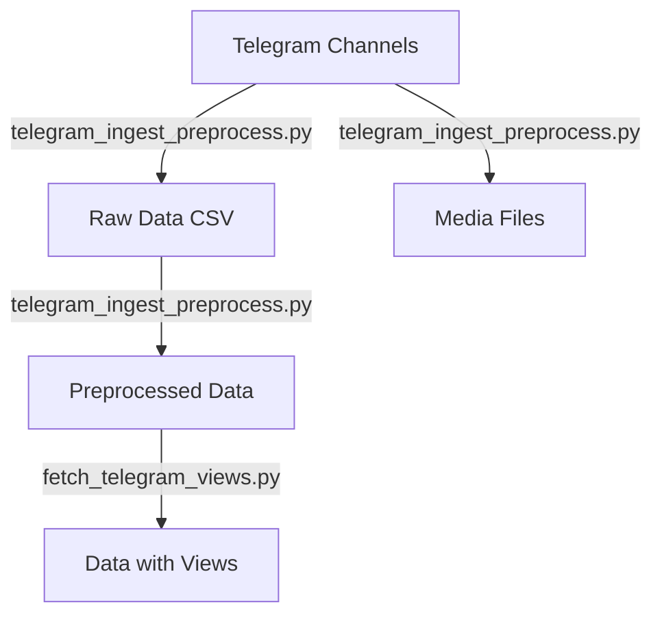

# Scripts Documentation

This directory contains Python scripts that form the core data pipeline for the Amharic E-commerce Data Extractor project.

## Script Overview

### 1. `telegram_ingest_preprocess.py`

**Purpose**: Downloads and preprocesses messages from Ethiopian e-commerce Telegram channels.

**Features**:
- Connects to Telegram API using credentials from environment variables
- Downloads messages from configured channels
- Performs Amharic-aware text normalization
- Saves both raw and preprocessed data

**Usage**:
```bash
# Set up environment variables
export TG_API_ID=your_api_id
export TG_API_HASH=your_api_hash

# Run script
python scripts/telegram_ingest_preprocess.py
```

**Output**:
- Raw data: `data/raw/telegram_data_TIMESTAMP.csv`
- Media files: `photos/` directory
- Preprocessed data: `data/preprocessed/telegram_data_preprocessed_TIMESTAMP.csv`

### 2. `fetch_telegram_views.py`

**Purpose**: Adds view counts to preprocessed data.

**Features**:
- Generates realistic view counts following Telegram patterns
- Maintains consistency in channel popularity
- Adds views column to preprocessed data

**Usage**:
```bash
python scripts/fetch_telegram_views.py
```

**Output**:
- Updates `data/preprocessed/telegram_data_preprocessed_*.csv` with view counts

## Environment Setup

1. Install dependencies:
```bash
pip install -r requirements.txt
```

2. Set up Telegram API credentials:
```bash
# Windows
set TG_API_ID=your_api_id
set TG_API_HASH=your_api_hash

# Linux/Mac
export TG_API_ID=your_api_id
export TG_API_HASH=your_api_hash
```

## Data Flow



## Error Handling

The scripts include robust error handling for:
- Missing API credentials
- Network connectivity issues
- Rate limiting
- Invalid message formats
- File system operations

## Contributing

When adding new scripts:
1. Follow the existing error handling patterns
2. Add comprehensive docstrings
3. Update this README
4. Add corresponding tests in `test/test_scripts.py`
